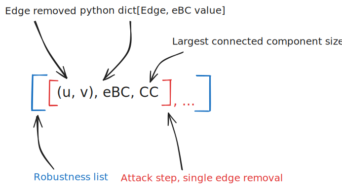

# Stage: Casser des graphes

## Outline

1. [Organization](#1-organization)
2. [Get started with OSMnx](#2-get-started-with-osmnx)
3. [Graph and KaHIP](#3-graphs-and-kahip)
4. [Cuts Clustering](#4-cuts-clustering)
5. [Robustness](#5-robustness)
6. [Visualization](#6-visualization)

### 1. Organization

The code is in the `src` module. If we follow the order we can found there:

* [BIRCHClustering.py](src/BIRCHClustering.py) *Work in progress*
* [CutsClassification.py](src/CutsClassification.py) contains two classes: `CutsClassification` and `HomemadeClassification`. The first one uses exact Chamfer distance and Louvain clustering algorithm while the second uses custom ways to cluster. Refer to [clustering](#4-cuts-clustering) for more details.
* [Graph.py](src/Graph.py) contains the `Graph` class for handling networkx and KaHIP graphs, their import and save. It's also there that cuts are made. And it's there that the graph metrics can be computed.
* [communities.py](src/communities.py) contains two wrappers, for Louvain and walktrap clustering algorithms. They can be used for creating communities on graph.
* [cuts_analysis.py](src/cuts_analysis.py) contains few functions for analysing cuts (frequency computations, correlation and cost evaluation...)
* [geo.py](src/geo.py) contains the `dist` function for evaluating the geographical distance between two edges and a neighborhood procedure that saves in a file a dict mapping each edge to its geographical neighbor (for a given range).
* [main.py](src/main.py) here we launch the code (**useless**).
* [parallel_eBC.py](src/parallel_eBC.py) an exemple of parallel eBC computation
* [paths.py](src/paths.py) contains some data paths (but the data isn't in the repo) (**useless**)
* [preprocessing.py](src/preprocessing.py) all the functions to get started with an OSMnx graph, see [this section](#2-get-started-with-osmnx) for more details.
* [procedures.py](src/procedures.py) samples of codes that have been in main, very useful to see how functions are manipulated.
* [robustness.py](src/robustness.py) see [this section](#5-robustness) for details.
* [typ.py](src/typ.py) contains the custom types and some descriptions of them.
* [visual.py](src/visual.py) contains nearly every displaying functions, mainly in matplotlib. See [this section](#6-visualization) for more details.

### 2. Get started with OSMnx

### 3. Graphs and KaHIP

### 4. Cuts Clustering

### 5. Robustness

The robustness part is about setting up attack strategies on networks and measuring their impact. The code is in the file [robustness.py](src/robustness.py). And contains:

1. `attack` and `extend_attack` functions, they respectively simulate an attack and extend a previous attack they both generate robustness lists, list that are made as follow:

Be careful: the removed edge and every eBC dict key is stored as a string in json, since tuples aren't supported. Consider using `eval` function to cast them to tuple.

2. Both of the functions above need a strategy to apply. Attack strategies are made of an order and a set.
Here are the available orders:

* **frequency:** uses the optional parameters `ncuts`, `imb` and `nblocks`. `ncuts` defines the number of cuts to do before establishing the edge appearance frequency and select the max. `imb` and `nblocks` are parameters for the cut, see [KaHIP section](#3-graphs-and-kahip) for more details. Be careful, frequency order doesn't support subsets, and an error will be raise.

* **betweenness:** uses the parameter `bc_approx` and `subset`. `bc_approx` takes an integer as the number of edge from which to compute the eBC approximation, if not set, real eBC will be computed. `subset` defines a subset of edges where the removed edges are taken.
* **random:** uses the optional parameters `subset` as in betweenness above. Select edges at random.
* **maxdegree:** uses the optional parameters `subset` as in betweenness above. Removes the biggest degree edge first, edge degree for the edge $(u, v) \in E$ is computed as:
$$deg(u) \cdot deg(v)$$

3. Some functions measuring robustness metrics can also be found in the same file. But use them through their [procedure](src/procedures.py).

### 6. Visualization
